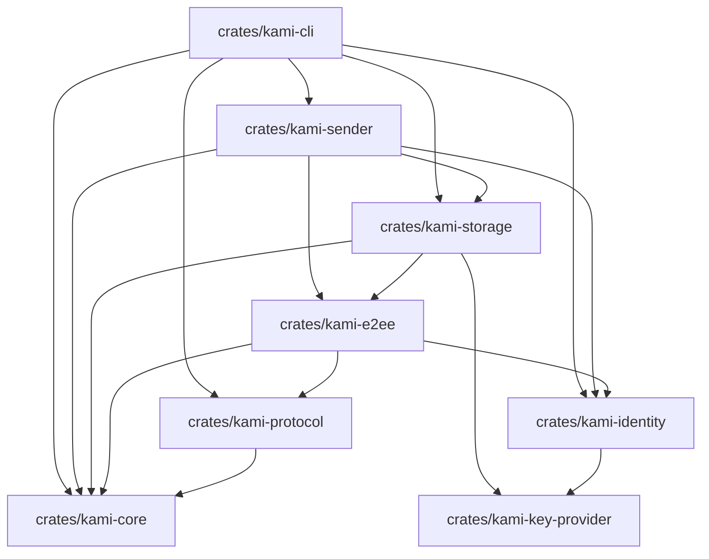

# Kami Code Analysis Home

Welcome to the **Kami Code Analysis** knowledge base. This documentation is designed to help you explore, learn, and track the Rust source code across all crates in the Kami workspace.

Whether you are new to Rust or learning the Kami architecture, these notes break down every module, struct, enum, and function into plain, beginner-friendly English with direct links to the source files.

---

## What is Kami?

**Kami** is a communication-first platform built for secure, end-to-end encrypted messaging between:
- Humans and humans
- Humans and AI agents
- AI agents and AI agents

Kami is built in **Rust** using an architecture-first approach. For Milestone 1 (M1), the goal is private, reliable one-to-one text messaging between two CLI endpoints across Linux, macOS, and Windows.

---

## Milestone 1 Status Overview

Milestone 1 focuses on seven core foundations:
1. **Domain Core**: Pure data structures, message identity, deduplication logic, and delivery state tracking (`kami-core`).
2. **Wire Protocol**: Strict, bounded, zero-allocation-on-bad-input Protobuf serialization (`kami-protocol`).
3. **Key Custody & Contact Trust**: OS keyring integration (Linux Secret Service, macOS Keychain, Windows Credential Manager), bilateral fingerprint verification, and signed Olm prekey bindings (`kami-identity`, `kami-key-provider`).
4. **End-to-End Encryption**: Matrix Vodozemac Olm v1 Double Ratchet engine, canonical inner envelopes, and staged authenticated commits (`kami-e2ee`).
5. **Encrypted Storage Engine**: SQLCipher-encrypted SQLite database with profile filesystem leasing, outbox retries, inbox deduplication, contact trust CAS, E2EE session persistence, and outbound sender state (`kami-storage`).
6. **Outbound Sender Coordinator**: Synchronous, runtime-neutral message coordination, sequence reservations, 30s attempt leases, exponential backoff, and exact-frame crash recovery (`kami-sender`).
7. **Background Service & CLI**: The client interface and background daemon (`kami-cli`, currently in scaffolding phase).

### Key Architectural & Jira Distinctions
- **KAMI-22 & KAMI-23 Functional Completion**: Both `kami-storage` (KAMI-22) and `kami-identity` (KAMI-23) are **functionally implemented in Rust**. Their Jira issues remain *In Progress* because native Windows and macOS platform qualification (filesystem ACLs and native keyring runs) remain release gates, not because core code is missing.
- **KAMI-50 (Contact Trust & Fingerprints)**: Fully implemented and tested. Enforces bilateral human verification and device-to-Peer-ID cryptographic binding.
- **KAMI-51 (E2EE Work Packages & Acceptance Scope)**:
  - Overall KAMI-51 Jira parent issue is **To Do**; full production messaging is disabled.
  - **WP1**: Maintained provider foundation (`vodozemac = 0.11.1`) with fail-closed public AAD boundary (`AadUnsupported`).
  - **WP2-A1**: Identity-owned signed Olm account and prekey binding.
  - **WP2-A2**: Canonical authenticated inner envelope (`InnerEnvelopeV1`) and 64 KB bounds.
  - **WP3**: Private persistence snapshots and SQLCipher migration 003 (**Owner Accepted** as a bounded private storage foundation).
  - **WP2-B**: Typed storage composition (`AuthenticatedCommit` via `Storage::commit_authenticated`), **Owner Accepted with Conditions** for quarantined scope only (no public activation, no ACK emission authority, no external rollback anchor, and no production qualification claim).
- **KAMI-24 (Outbound Sender Coordination & Persistence)**:
  - **Owner-Accepted Bounded Implementation** (`t_3caec9e9`, QA `t_d1b015bb` PASS, Evaluator `t_4c8b8ad4` PASS).
  - Consumes accepted WP3 and WP2-B storage foundations.
  - Implements `Coordinator::enqueue`, `claim`, and `resume` in `kami-sender`.
  - Introduces SQLCipher Migration `004_sender_state.sql` (`sender_binding_key`, `sender_prepare`, `sender_attempt`).
  - Keyed HMAC-SHA256 request binding, lane fencing via partial unique index `sender_prepare_lane`, 30s attempt leases, deterministic exponential backoff (1s base, 5min cap, 8 max attempts), cancellation, and identity holds.
  - **Exact-Frame Crash Recovery**: Re-submitting or recovering an already committed request returns exact stored ciphertext without re-encrypting or advancing ratchets.
  - **Scope Boundary**: Synchronous service layer only. Defers Tokio runtime, timers, network transport, live end-peer provenance, and receipt emission to downstream issues (KAMI-25, KAMI-26, KAMI-27, KAMI-31).
- **Reverse Dependency Pattern (`kami-storage → kami-e2ee`)**: `kami-storage` depends on `kami-e2ee` to consume opaque authenticated commits, while `kami-e2ee` never depends on storage. This preserves cryptographic purity and ensures unauthenticated data cannot bypass validation into the database.

### Overall M1 Progress: **Not estimable**
*Milestone 1 acceptance requires two independently verified human CLI endpoints exchanging private text across Linux, Windows, and macOS with direct P2P and genuine automatic relay fallback. While domain, wire protocol, key custody, contact trust, encrypted storage, quarantined E2EE, and sender coordinator foundations are implemented and pass on Linux, broader platform qualification, real network fallback, receiver lifecycle (KAMI-25), daemon integration (KAMI-26), and P2P transport (KAMI-27) remain to be done. Subjective percentage estimates are replaced with evidence-based milestone statuses.*

*Whole-project progress: **Not estimable** (broader roadmap items like multi-device synchronization, offline mailbox relays, and agent harness bridges are not yet fully specified).*

---

## Workspace Crates Map

| Crate Note | Primary Purpose | Milestone 1 Status | Test Status |
| :--- | :--- | :--- | :--- |
| [[kami-core]] | Pure domain facts, state machine transitions, and queue limits (no I/O or dependencies). | **100%** of domain scope | Verified (unit tests, 5 proptests, 7 golden vectors, 99.6% coverage) |
| [[kami-protocol]] | Bounded Protobuf encoding/decoding and structural frame validation (up to 64 KB). | **100%** of wire frame scope | Verified (unit tests, vectors, fuzz/proptests, memory probe) |
| [[kami-key-provider]] | Synchronous database key custody contract and memory-zeroizing key type. | **100%** of contract scope | Verified (unit tests, fault injection, restart/loss tests) |
| [[kami-identity]] | OS keyring custody, contact trust (KAMI-50), and signed Olm prekey bindings (WP2-A1). | **Not estimable** *(Functionally Implemented)* | Verified on Linux; Windows/macOS compiled & Clippy-checked; native qualification pending |
| [[kami-storage]] | SQLCipher encrypted local database, profile leasing, migrations 001-004, E2EE commits, and sender state. | **Not estimable** *(Functionally Implemented & Owner-Accepted Foundations)* | Verified on Linux (migrations 001-004, crash-kill checkpoints, CAS, WAL, sender state); native qualification pending |
| [[kami-e2ee]] | Vodozemac Double Ratchet adapter, inner envelope, and typed storage commits (KAMI-51). | **Not estimable** *(Quarantined Foundation Accepted with Conditions)* | Verified on Linux (93 tests, privacy probe, qualification suites); runtime/network deferred |
| [[kami-sender]] | Synchronous outbound message coordination, sequence reservations, attempt leases, and crash recovery. | **Not estimable** *(Owner-Accepted Bounded Implementation)* | Verified on Linux (coordinator race tests, exponential retry tests); runtime/network transport deferred |
| [[kami-cli]] | Command-line client and background service daemon. | **Scaffold only** *(15% placeholder)* | Scaffold tests only; IPC and commands pending |

---

## Architecture & Dependency Flow

```mermaid
graph TD
    CLI[crates/kami-cli] --> CORE[crates/kami-core]
    CLI --> PROTO[crates/kami-protocol]
    CLI --> STORAGE[crates/kami-storage]
    CLI --> IDENTITY[crates/kami-identity]
    CLI --> SENDER[crates/kami-sender]

    SENDER --> CORE
    SENDER --> STORAGE
    SENDER --> E2EE[crates/kami-e2ee]
    SENDER --> IDENTITY

    STORAGE --> CORE
    STORAGE --> KEYPROV[crates/kami-key-provider]
    STORAGE --> E2EE

    E2EE --> CORE
    E2EE --> IDENTITY
    E2EE --> PROTO

    IDENTITY --> KEYPROV
    PROTO --> CORE
```

> [!NOTE]
> `kami-sender` coordinates outbound messages by orchestrating `kami-storage`, `kami-e2ee`, `kami-identity`, and `kami-core`. Notice that `kami-storage` retains its reverse dependency on `kami-e2ee` to consume `AuthenticatedCommit`, guaranteeing that only cryptographically verified frames reach disk persistence.

---

## How to Navigate These Notes

Each crate note is organized into three beginner-friendly sections:
1. **Overview**: Explains the crate's purpose, what real-world problem it solves in Kami, its dependencies, and relevant Jira/roadmap requirements.
2. **Source Code Explanation**: Hierarchical breakdown of every module, struct, enum, and method. Explains what each type represents, why Kami needs it, key fields, and how functions work with their error conditions and security implications.
3. **Completion & Verification**: An evidence-based scorecard showing implemented behavior, verified tests, missing behavior, known limitations, and exact `cargo` commands you can run to test the code yourself.

Explore the individual crate documentation:
- [[kami-core]]: Pure message identity and delivery state machine
- [[kami-protocol]]: Strict Protobuf network frames
- [[kami-key-provider]]: Injected encryption key contracts
- [[kami-identity]]: OS keyrings, device fingerprints, and Olm bindings
- [[kami-storage]]: Encrypted SQLCipher database, profile leases, migrations 001-004, and sender state
- [[kami-e2ee]]: Double Ratchet session engine, authenticated envelopes, and typed commits
- [[kami-sender]]: Outbound message coordination, sequence reservations, attempt leases, and crash recovery
- [[kami-cli]]: User commands and daemon scaffold

---

## Analysis Baseline & Working Tree Manifest

- **Git Branch**: `protocol-storage`
- **Git Commit (HEAD)**: `0002406ea6e0c12789df74ff12e04c96a3b8f122`
- **Analysis Timestamp**: `2026-11-05T22:56:00Z`
- **Toolchain**: Rust 2021 Edition / Cargo workspace

### Working Tree Source Manifest (Uncommitted & Untracked Baseline)
To ensure incremental re-analysis reliably detects modifications even when `HEAD` commit remains unchanged, the following SHA-256 hashes record the exact state of all analyzed working tree files:

| File Path | Working Tree Status | SHA-256 Digest |
| :--- | :--- | :--- |
| `Cargo.toml` | Tracked (Modified) | `c4a437c337ef364d290e008ab740254391e01704ada2ec5c80d78a4b5a91f050` |
| `Cargo.lock` | Tracked (Modified) | `efa2b0e7fd940ab93719684d0a84c8d7416e9e59d078f41010285aff9a661675` |
| `README.md` | Tracked (Modified) | `9407dc74ec9cb67f928fbfbc89456076bfc0ee4936fc7b1c13dc78609645c102` |
| `docs/KAMI_DEVELOPMENT_ROADMAP.md` | Tracked (Modified) | `12056f5d8085d5a94bbdc871e6ca7eb84d0f2c2d52f519ea2afff4e64e731645` |
| `crates/kami-sender/Cargo.toml` | Untracked | `ca7c0bb611bb31d186abdec1f9b97f7c9f5ff328d0089c317c686b8a0e0c1b4d` |
| `crates/kami-sender/README.md` | Untracked | `954498323a3f1a1038cf9b0398cfac48cf7cfe70031acfbc2ba7139061df778e` |
| `crates/kami-sender/src/lib.rs` | Untracked | `fad36a16df86304e555067f498b8083cdde15bc2a4984e056904fb9dfb2c1567` |
| `crates/kami-sender/src/coordinator.rs` | Untracked | `de02117d0865be12de7cd412aa435b4bd3e895b3415a6f2af25c6ffccbf59bc2` |
| `crates/kami-sender/src/retry.rs` | Untracked | `68046059d86b52d9c2f7606e5f9dcd512d4deab282ce82e44030120c3f1a24de` |
| `crates/kami-sender/src/error.rs` | Untracked | `385ac1a3c362c019ef3236b8af934b45e5957572c792facd5f1e53e1f7a2a3d9` |
| `crates/kami-sender/tests/coordinator.rs` | Untracked | `a3d4c3f765e768558d61e2bd7dff95b34ee3610f5a38cb376fd4b8eb410d3f3d` |
| `crates/kami-sender/tests/retry_state.rs` | Untracked | `99d292be7fcc1669bb499409e49b7abea9a0b6030e1697b2d3b5ce72e1f1620b` |
| `crates/kami-storage/Cargo.toml` | Tracked (Modified) | `ce1a68300dd1b6e372ca0deb2fbe0d838fbd0c607a4941d55636f7b1976856e5` |
| `crates/kami-storage/README.md` | Tracked (Modified) | `0ec5048e645e26eb2c49db09d939fe07f263778c381541f2b2c958c9ed567a03` |
| `crates/kami-storage/migrations/004_sender_state.sql` | Untracked | `78f3dcdd3724461d43bc5cd31463e5e3dee4c6473bc4eff3394c35903b2a6da1` |
| `crates/kami-storage/src/lib.rs` | Tracked (Modified) | `b4631dbe2007392f0cb3800a0d4f8d1a45f0e081b79a25df00b6cf612b39f156` |
| `crates/kami-storage/src/migrations.rs` | Tracked (Modified) | `47da193b40efbdff8c53099274410d8a03a39612a83d686fe45a5321844587b2` |
| `crates/kami-storage/src/sender_state.rs` | Untracked | `bf04212291ac57c5fb43d2fc97b0190c4e163cf7d5063308a2779ae882a7dd88` |
| `crates/kami-storage/src/transactions.rs` | Tracked (Modified) | `f3fb80b18b817a5daf8275910547f10b08662820f6054ecc0dbce50334f6bf20` |
| `crates/kami-storage/src/worker.rs` | Tracked (Modified) | `4044782f04f9cb2d06596bd3bd52a7ac0f437c8b8119eaab81f2a18e1e1e2543` |
| `crates/kami-storage/tests/sender_input.rs` | Untracked | `fed0a4e7b396864af9a88097b00689485ede2e77a4ab42429034cd93682474ca` |
| `crates/kami-storage/tests/sender_state.rs` | Untracked | `0ae0602597d522d5baa21a9d872750b9f56b79e91da3dd2cc5efc0663f966225` |
| `crates/kami-identity/src/custody.rs` | Tracked (Modified) | `9204ec9ca888a695064ef9032faa0533fcfd5dacbf4b9ec78de3a442d2871cc5` |
| `crates/kami-identity/src/lib.rs` | Tracked (Modified) | `536876f0b0cdb3ef916534b97f82ca90940a0f92c61b673386434389beaae45c` |
| `crates/kami-identity/src/olm_binding.rs` | Untracked | `42ca0761bac86b61428f31a6bf5b08103c0b25ee0c7d5c349ad8fe92212bce08` |
| `crates/kami-identity/tests/olm_binding.rs` | Untracked | `1e65b221267cfcb2681bfbeff33480f1521786d1f438f712101aeb1f63a472f3` |
| `crates/kami-e2ee/Cargo.toml` | Untracked | `952e516e217d51de22e371c3420420c4bd2f8ccced5ef24d7b53f6bc9e41134c` |
| `crates/kami-e2ee/src/authenticated.rs` | Untracked | `e0e1ba780d4c5a734b04409b9cdb5d050d86fea3ebfd988bfe46cb8537dd894e` |
| `crates/kami-e2ee/src/envelope.rs` | Untracked | `2eb84a28d3a056bc2c5b67587334adc50b94fc6230f5c5e2bb5eeb888b05e543` |
| `crates/kami-e2ee/src/errors.rs` | Untracked | `7dc030598a70dca657c6106d757e6485d5eb905d54291f7c559c61e8c1c0adb3` |
| `crates/kami-e2ee/src/lib.rs` | Untracked | `d7cb107544d70afb3d56723d1425e956e51e84234c555ab1fa5ba5f4d74a07b9` |
| `crates/kami-e2ee/src/persistence.rs` | Untracked | `10cf23f5ea7a02398c765f94fa39f12933f807c6fad335312b6f1c72f3edd371` |
